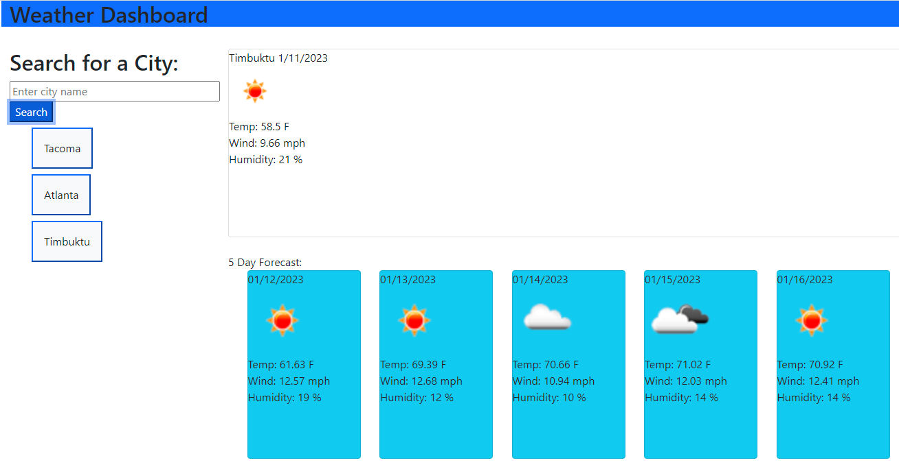

# Weather-5day
## Description

This app will provide current weather data as well as a 5 day forcast for any city typed in the search bar. just type hit search and wait for the results to come up
You'll never be caught off guard again! 

## Installation

What are the steps required to install your project? Provide a step-by-step description of how to get the development environment running.

## Usage
I used bootstrap, jquery, jqueryui to help style and format.
The APIS I used were Dayjs, and the OpenWeatherMap API to get various data

    
 

## License

Please refer to the license in the repo

## How to Contribute
[Contributor Covenant](https://www.contributor-covenant.org/)

